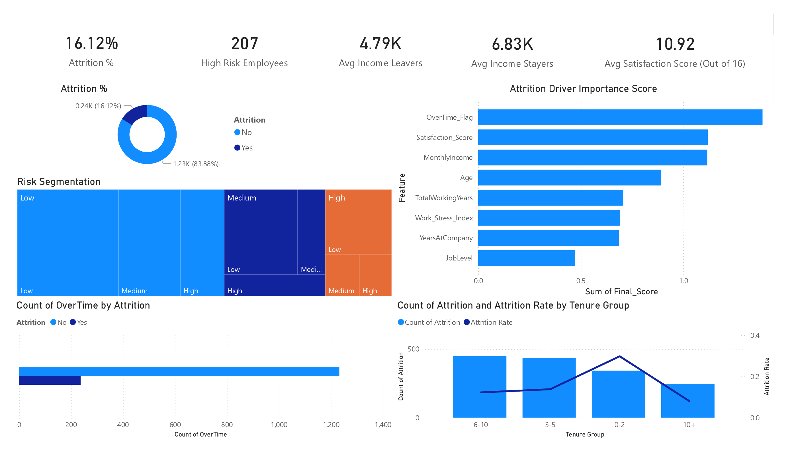

# HR Attrition Analysis & Prediction

## Project Overview
This project analyzes employee attrition using data analytics and machine learning techniques. The goal is to identify key factors influencing employee turnover and provide actionable insights to improve retention strategies.

---

## Project Insights



---

## Notebook (Google Colab)

You can explore the complete analysis and modeling workflow here:

[Open in Google Colab](https://colab.research.google.com/drive/1IqZFmuoSfLxPxTfWPMcZoVCKFaPDYD-Q)

---

## Objectives
- Understand attrition trends and patterns
- Identify key drivers of employee turnover
- Build a predictive model for attrition risk
- Create an interactive Power BI dashboard
- Provide business recommendations

---

## Project Workflow
Data → Cleaning → EDA → Feature Engineering → Statistical Analysis → ML Modeling → Dashboard → Insights

---

## Dataset
- HR Employee Attrition Dataset
- Includes features like:
  - Age, Income, Job Role, Department
  - Satisfaction Metrics
  - Work Conditions (OverTime, Travel)
  - Tenure and Experience

---

## Exploratory Data Analysis (EDA)

### Key Findings:
- Overtime increases attrition by ~3x
- Low income employees have highest attrition
- Early tenure (0–2 years) shows maximum churn
- Low satisfaction strongly correlates with attrition
- Sales and HR departments have higher turnover

---

## Feature Engineering

Created new features:
- Satisfaction Score (composite)
- Work Stress Index
- Tenure Ratio
- Income per Experience
- Risk Segmentation Features

---

## Statistical Analysis

- Chi-Square Test → categorical variables
- T-Test → numerical variables
- Effect Size (Cohen’s d)

### Key Insight:
Attrition is statistically driven by:
- Income
- Satisfaction
- Tenure
- Overtime

---

## Machine Learning

### Models Used:
- Logistic Regression (Interpretability)
- Random Forest (Feature Importance)

### Key Drivers Identified:
1. OverTime
2. Satisfaction Score
3. Monthly Income
4. Age
5. Years at Company

---

## Power BI Dashboard

### Features:
- KPI Cards (Attrition %, High Risk Employees)
- Driver Analysis
- Risk Segmentation
- Behavioral Analysis (OverTime)
- Tenure Analysis

---

## Business Insights

- Attrition is multi-factor driven
- Burnout (OverTime) is the strongest immediate driver
- Compensation is the primary structural driver
- Early tenure employees are high-risk

---

## Recommendations

- Optimize compensation structure
- Reduce overtime and workload imbalance
- Improve onboarding programs
- Monitor employee satisfaction regularly
- Implement predictive HR analytics

---

## Project Structure

```
hr-attrition-analysis-ml-dashboard/
│
├── data/
│   ├── HR_Attrition_Final.csv
│   ├── HR_Attrition_Engineered.csv
│   ├── Attrition_Driver_Ranking.csv
│
├── notebooks/
│   ├── HR_Attrition_Analysis.ipynb
│
├── powerbi/
│   ├── HR_Attrition_Dashboard.pbix
│
├── reports/
│   ├── HR_Attrition_Analysis_Report_Detailed.pdf
│   ├── HR_Attrition_Report.pptx
│
├── images/
│   ├── Attrition-by-BusinessTravel.png
│   ├── Attrition-by-Dept.png
│   ├── Attrition-by-JobRole.png
│   ├── Attrition-by-MaritalStatus.png
│   ├── Attrition-by-OverTime.png
│   ├── MonthlyIncome-vs-Attrition.png
│   ├── SatisfactionScore-vs-Attrition.png
│   ├── WorkStressIndex-vs-Attrition.png
│   ├── YearsAtCompany-vs-Attrition.png
│   ├── dashboard_preview.png
│
├── README.md
└── requirements.txt
```

---

## Tools & Technologies

- Python (Pandas, NumPy, Matplotlib, Seaborn)
- Scikit-learn (ML Models)
- SciPy (Statistical Testing)
- SQL (Data Analysis)
- Power BI (Dashboard)

---

## Future Improvements

- Handle class imbalance (SMOTE)
- Add SHAP for model explainability
- Deploy Streamlit app for prediction
- Integrate real-time HR analytics
